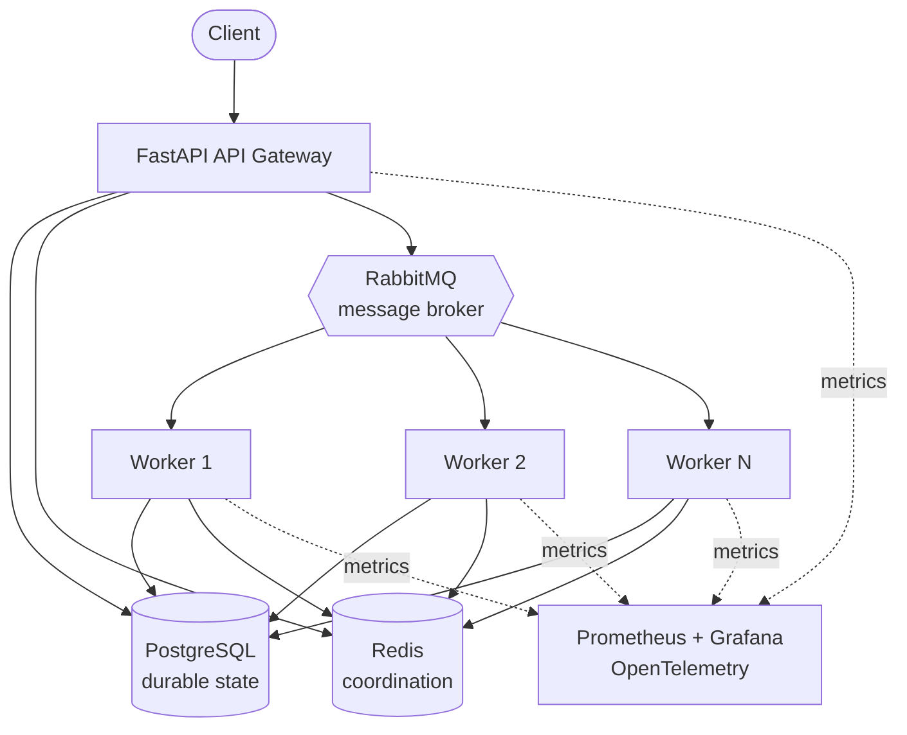

# Distributed Task Queue & Job Execution Platform

A miniature, production-style distributed job execution platform built to
learn — and demonstrate — how systems like Celery, Sidekiq, or a cloud
provider's managed task queue actually work under the hood.

The core execution path (message broker, worker consumers, retries,
idempotency, coordination) is built directly on RabbitMQ and Redis rather
than on a high-level task queue framework, so the distributed-systems
mechanics stay visible instead of hidden behind a library.

## Status

This project is being built incrementally, phase by phase, with an
explanatory commit history. **Currently at Phase 1: repository and
environment setup.** No application code exists yet — see
[docs/adr](docs/adr) and the architecture doc below for the plan.

## Architecture (target)



See [docs/architecture.md](docs/architecture.md) for the full breakdown of
each component's responsibility, and [docs/adr](docs/adr) for the reasoning
behind each major technology choice.

## Technology stack

| Concern | Technology |
|---|---|
| API framework | FastAPI |
| Language / runtime | Python 3.12+, asyncio |
| Message broker | RabbitMQ (via aio-pika) |
| Coordination / caching | Redis |
| Durable storage | PostgreSQL (SQLAlchemy 2.x, Alembic) |
| Observability | Prometheus, Grafana, OpenTelemetry |
| Deployment | Docker, Docker Compose |
| Testing | pytest, pytest-asyncio, httpx, testcontainers |
| Load testing | Locust |

Explicitly **not** used for the core implementation: Celery, RQ, Dramatiq,
or any other high-level task queue framework — the point of this project is
to understand what those libraries do internally.

## Project structure

```
distributed-task-queue/
├── services/           # deployable processes: api, worker, scheduler
├── domain/             # models, state machine, exceptions (framework-free)
├── messaging/          # RabbitMQ topology: exchanges, queues, publisher/consumer
├── persistence/        # SQLAlchemy models, repositories, Alembic migrations
├── coordination/        # Redis: worker registry, heartbeats, rate limiter
├── scheduling/          # scheduled-task polling/claiming service
├── observability/       # metrics, structured logging, tracing
├── task_handlers/       # the safe, registered set of executable task types
├── tests/               # unit, integration, e2e
├── docker/              # Dockerfiles
├── prometheus/          # Prometheus config
├── grafana/             # Grafana dashboards/provisioning
├── scripts/             # dev/ops scripts
└── docs/                # architecture docs and ADRs
```

## Getting started (Phase 1: infrastructure only)

```bash
cp .env.example .env
docker compose up -d
docker compose ps
```

This brings up PostgreSQL, RabbitMQ (management UI at
http://localhost:15672), and Redis. There is no API or worker to run yet —
those arrive in later phases.

### Python environment

```bash
python3.12 -m venv .venv
source .venv/bin/activate
pip install -e ".[dev]"
```
