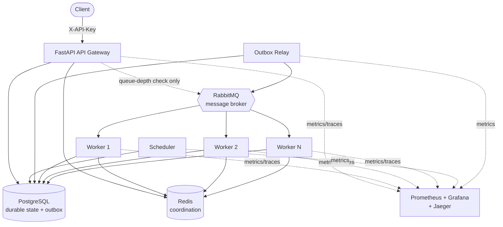

# Distributed Task Queue & Job Execution Platform

A production-style distributed job execution platform built to learn —
and demonstrate — how systems like Celery, Sidekiq, or a cloud provider's
managed task queue actually work under the hood.

The core execution path (message broker, worker consumers, retries,
idempotency, coordination) is built directly on RabbitMQ and Redis rather
than on a high-level task queue framework, so the distributed-systems
mechanics stay visible instead of hidden behind a library.

## Status

**All 24 phases complete.** Built incrementally, phase by phase, with an
explanatory commit history — every commit maps to one phase, and every
non-obvious design decision is documented in code comments/docstrings and
in [docs/](docs/) as it was made, not retrofitted afterward.

What's here: the task model and state machine; RabbitMQ topology with a
transactional outbox for exactly-the-outbox-guarantees-you'd-expect
publishing; a worker with bounded concurrency, timeouts, cancellation, and
graceful shutdown; retries with exponential backoff/jitter and a
dead-letter queue; a Redis-backed worker registry with heartbeats and two
load-balancing strategies; request idempotency; rate limiting and
queue-depth backpressure; weighted priority scheduling; a scheduler for
deferred/scheduled tasks; Prometheus metrics with Grafana dashboards;
OpenTelemetry distributed tracing via Jaeger; a per-task-type circuit
breaker; a real, committed chaos/failure-injection test suite
(`scripts/chaos_test.py`); a hand-rolled load-testing tool
(`scripts/load_test.py`); and API key authentication, a request body size
limit, and non-root containers.

See [docs/architecture.md](docs/architecture.md) for the full component
breakdown, [docs/adr](docs/adr) for the reasoning behind the three
foundational technology choices, and every other file under
[docs/](docs/) for one phase's design decisions each.

## Architecture



The API never publishes to RabbitMQ directly (see
[docs/outbox.md](docs/outbox.md)): every write lands in Postgres's outbox
table in the same transaction as the task row, and the Outbox Relay is the
only process that drains it into RabbitMQ. The Scheduler polls Postgres
for tasks whose `scheduled_at` has arrived and hands them to the same
outbox path. See [docs/architecture.md](docs/architecture.md) for why
each component exists and how they fit together.

## Technology stack

| Concern | Technology |
|---|---|
| API framework | FastAPI |
| Language / runtime | Python 3.12+, asyncio |
| Message broker | RabbitMQ (via aio-pika) |
| Coordination / caching | Redis |
| Durable storage | PostgreSQL (SQLAlchemy 2.x, Alembic) |
| Observability | Prometheus, Grafana, OpenTelemetry (Jaeger) |
| Deployment | Docker, Docker Compose; non-root containers |
| API authentication | Shared `X-API-Key` header (see [docs/security.md](docs/security.md)) |
| Verification | Ad hoc per-phase scripts against embedded Postgres (`pgserver`)/`fakeredis`, plus two scripts committed for ongoing use against a real live stack: `scripts/chaos_test.py` (failure injection) and `scripts/load_test.py` (load testing, hand-rolled on `httpx`/`asyncio`/`typer`) |

Explicitly **not** used for the core implementation: Celery, RQ, Dramatiq,
or any other high-level task queue framework — the point of this project is
to understand what those libraries do internally. See
[docs/adr](docs/adr) for the full reasoning behind this and the other two
foundational choices (FastAPI over Spring Boot, RabbitMQ as the broker).

`tests/` is scaffolding from Phase 1's initial commit and was never
populated with a conventional pytest suite -- this project's actual
verification approach, documented as it went, turned out to be per-phase
scripts run against `pgserver`/`fakeredis` during development (thrown away
once a phase was verified and committed) plus the two scripts above, which
*are* committed because they're meant to be rerun against a real stack at
any time, not one-off development checks.

## Project structure

```
distributed-task-queue/
├── services/            # deployable processes: api, worker, scheduler, outbox_relay
├── domain/              # models, state machine, retry policy, circuit breaker (framework-free)
├── messaging/           # RabbitMQ topology: exchanges, queues, publisher/consumer, backpressure
├── persistence/         # SQLAlchemy models, repositories, Alembic migrations
├── coordination/        # Redis: worker registry, heartbeats, rate limiter, cancellation
├── scheduling/          # scheduled-task polling/claiming logic
├── observability/       # metrics, tracing setup
├── task_handlers/       # the safe, registered set of executable task types
├── scripts/             # committed, rerunnable chaos/load-testing scripts
├── docker/              # one Dockerfile per service
├── prometheus/          # Prometheus config
├── grafana/             # Grafana dashboards/provisioning
└── docs/                # one doc per phase's design decisions, plus docs/adr
```

## Getting started

```bash
cp .env.example .env
# edit .env: at minimum, set a real API_KEY (not "change-me")
docker compose up -d
docker compose ps
```

This brings up all nine services: PostgreSQL, RabbitMQ (management UI at
http://localhost:15672), Redis, the API (http://localhost:8000), a worker,
the scheduler, the outbox relay, Prometheus (http://localhost:9090),
Grafana (http://localhost:3000), and Jaeger
(http://localhost:16686).

### Submitting a task

Every `/tasks` and `/workers` call needs the `X-API-Key` header, set to
whatever `API_KEY` your `.env` has:

```bash
curl -X POST http://localhost:8000/tasks \
  -H "X-API-Key: ${API_KEY}" \
  -H "Content-Type: application/json" \
  -d '{"task_type": "echo", "payload": {"hello": "world"}}'

curl http://localhost:8000/tasks/<task_id> -H "X-API-Key: ${API_KEY}"
```

`/health`, `/ready`, and `/metrics` stay open with no key (see
[docs/security.md](docs/security.md) for why).

### Python environment (for running scripts, or developing locally)

```bash
python3.12 -m venv .venv
source .venv/bin/activate
pip install -e ".[dev]"

# with the stack already up:
python scripts/chaos_test.py run-all
python scripts/load_test.py run --rate 20 --duration 30
```
